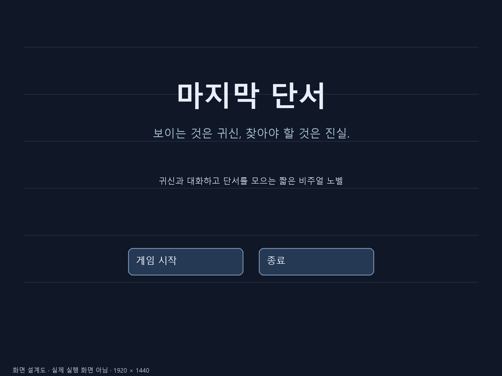
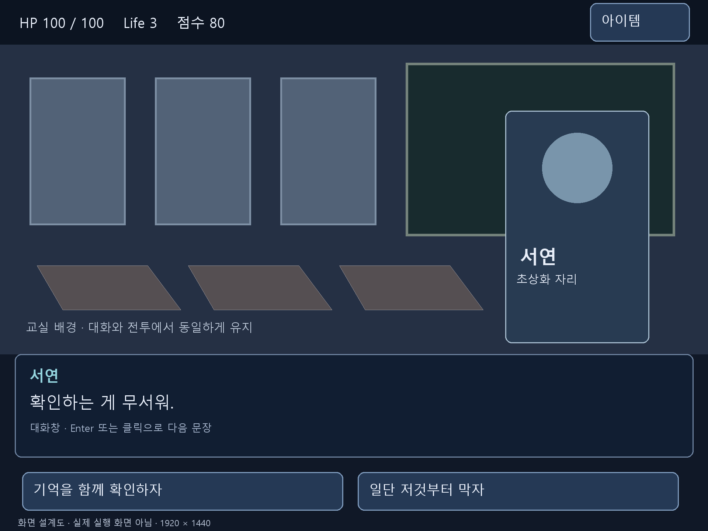
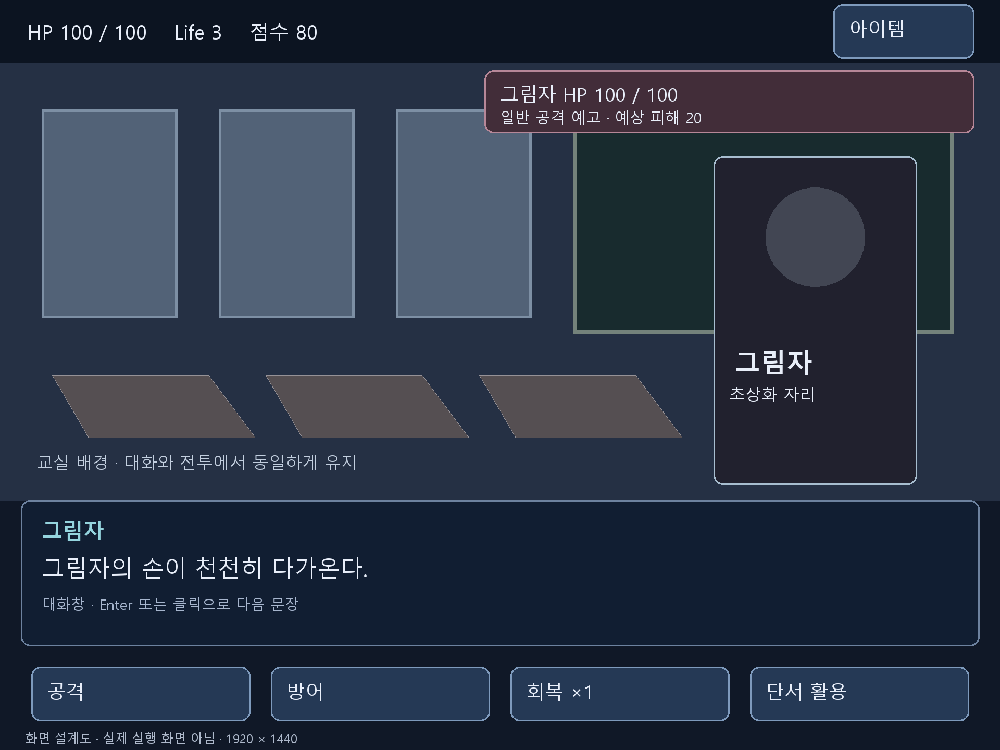
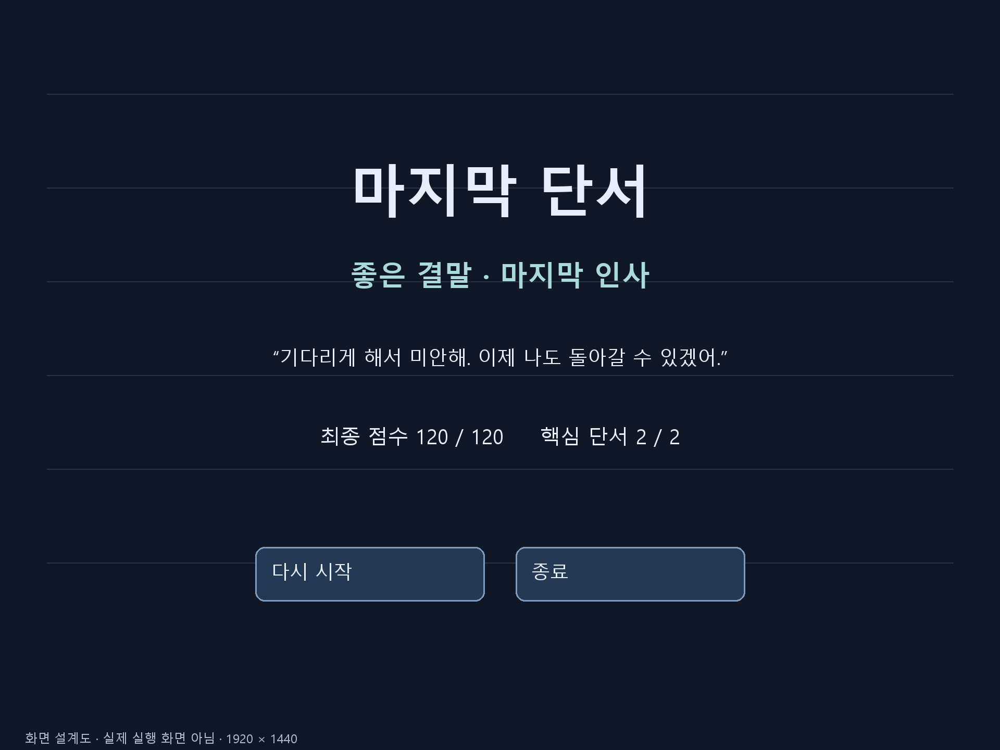

# 화면 구성 자료

모든 그림은 1920×1440(4:3)의 문서용 설계도이다. 배경과 인물은 위치를 설명하는 도형이며 실제 게임 리소스나 실행 캡처가 아니다.

## 화면별 구성

| 화면 | 표시 내용 | 다음 동작 |
| --- | --- | --- |
| 시작 | 제목, 설명, 시작·종료 | 시작하면 초기화 후 복도 대화 |
| 대화 | HP·Life·점수, 배경, 귀신, 대화창, 선택지 2개 | 선택 결과 적용 후 다음 대사 |
| 전투 | 기존 배경·대화창, 적 HP·행동 예고, 명령 4개 | 명령→결과→다음 턴 또는 승리 대사 |
| 결과 | 결말 제목·내용, 점수·단서 수, 다시 시작·종료 | 다시 시작하면 모든 상태 초기화 |

## 영역과 입력

- 상태 표시: x=0~1919, y=0~119.
- 배경·인물: x=0~1919, y=120~959. 적 HP와 예고는 이 영역 위에 표시한다.
- 대화창: x=40~1880, y=960~1240. 인물 이름과 최대 두 줄의 문장을 배치한다.
- 명령 영역: y=1260~1439. 대화 버튼 2개 또는 전투 버튼 4개를 표시한다.
- 초상화는 약 x=1370~1760에 두되 실제 이미지 종횡비를 유지한다.
- 게임 기준 글자 크기: 대사 44px, 이름 40px, 명령 36px, 안내 28px.
- 작은 모니터에서는 4:3 비율로 축소하고 남는 공간을 여백 처리한다. 버튼 판정도 같은 좌표 변환을 사용한다.
- 아이템 버튼은 목록 패널을 연다. 목록은 회복약·열쇠·사진·기록의 보유 상태만 표시하며 닫기 버튼을 둔다. 회복은 전투 명령에서 사용한다.
- ESC 메뉴는 재개·종료 두 버튼으로 구성한다. 패널이 열려 있을 때 뒤쪽 대사나 전투 버튼은 입력을 받지 않는다.
- 선택 강조, 비활성 명령, 결과 메시지 출력 중 입력 제한을 시각적으로 구분한다.

## 전환 원칙

대화 예시와 전투 예시는 같은 교실 배경을 사용한다. 그림자가 위협 대사로 먼저 등장한 뒤 적 HP·예고·명령만 추가된다. 별도 전투 배경을 로드하지 않는다. 승리하면 전투 UI를 숨기고 후속 대사를 출력한다.

## 설계 이미지

## 이미지와 텍스트 연출

서준은 1인칭 시점이며 별도 초상화를 쓰지 않는다. 서연과 그림자는 고정 이미지 각 1장으로 표시한다. 손짓·이동·표정 변화는 짧은 지문으로 전달하고 공격·붕괴는 기존 효과음과 메시지로 표현한다. 귀신의 퇴장은 초상화를 숨겨 표현한다. 대화·전투는 같은 배경과 대화창을 공유한다. 프롤로그의 폐교 외부는 복도 배경 위에 지문으로 설명한다.

사진과 사고 기록은 설명 텍스트로 표시하며 별도 단서 이미지는 사용하지 않는다. 붕괴와 기록 훼손 소리는 공격·피해 효과음을 공용으로 사용한다.
